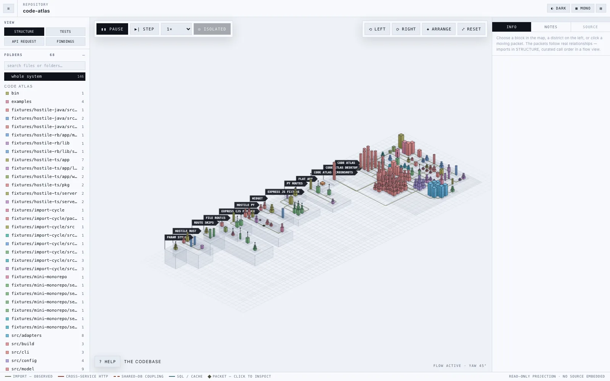
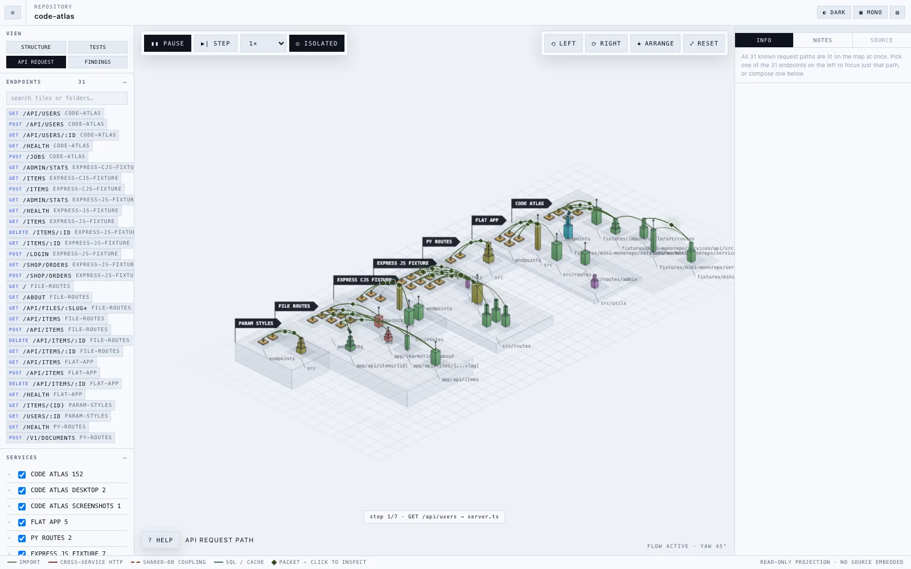
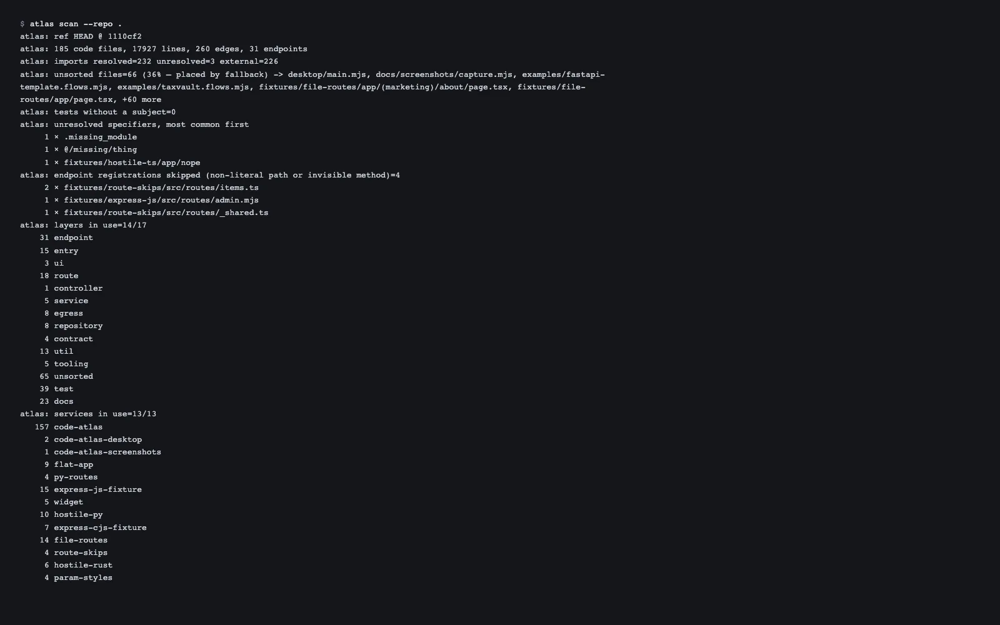

# code-atlas

Interactive codebase maps showing files, imports, test reach, inferred request paths, and structural findings.



*STRUCTURE, drawn from this repository. Rows are services, columns are folders, and block height is file length.*



*API REQUEST shows all paths or one endpoint at a time. Paths are inferred from imports.*



*`atlas scan` lists resolved imports, unresolved references, and skipped route registrations.*

Dark theme, TESTS, FINDINGS, and the test-run capture are in [docs/screenshots](docs/screenshots), which also holds the capture script. Regenerate with
`cd docs/screenshots && npm ci && npx playwright install chromium && npm run capture`
(Node.js and `cwebp` required).

> **Status: v1.1.0.** `build`, `scan`, `init`, `serve`, and `findings` work
> with or without a config. Live mode
> sends a real request when you explicitly turn it on, and is off by default:
> everything else the tool draws is read from the repository or modelled from it.
>
> See **[PLAN.md](./PLAN.md)** for the design and **[ROADMAP.md](./ROADMAP.md)** for
> progress. Individual structural decisions are recorded as
> **[ADRs](./docs/adr/)**.

## Quickstart

Install it once, then run it anywhere:

```bash
npm install -g code-atlas
cd /path/to/your/repo
atlas
```

That maps the repository you are standing in and opens it in your browser. It
reads your working tree, not your last commit, so uncommitted work shows up.

Or run it without installing anything:

```bash
npx code-atlas
```

The result is a self-contained HTML file that opens in a browser without a server.

If many files are UNSORTED, accept the starter-config prompt, edit the generated
config, and run `atlas` again.

To read source alongside the map, jumping from a node to the file that produced
it, start the local viewer instead:

```bash
atlas serve --open
```

`serve` binds to `127.0.0.1` only, and every command except `atlas init` is
read-only on your repository. No config file is required; without one, atlas
detects your services and layers on its own.

Node 20 or newer. To work on atlas itself, clone it and use `node bin/atlas.mjs`
in place of `atlas`.

## What is real and what is modeled

Files, import edges, and endpoint declarations come from static analysis.
Request paths are inferred, not traces. Calibration measured **17% precision /
12% recall** on TaxVault and **23% / 16%** on the FastAPI template; see the
[measurements and limitations](docs/guide.md#what-is-real-and-what-is-modeled).
Regex scanning misses computed imports and routes. Unsupported languages still
render structure, but do not contribute import edges. Live mode is opt-in,
restricted to local/private targets, and reports only the overall HTTP result.
It never measures internal hop timing.

## Configuration

None is required. Without a config, services are detected from manifests and
layers from directory names, and every placement still records its reason.
`atlas init` writes a starter config by inspecting the repository.

Two worked examples ship in the repo:

- `fixtures/mini-monorepo/atlas.config.mjs`: three services with layers based on directory names.
- `examples/taxvault.config.mjs`: five services with custom layers, route prefixes, datastores, and explicit edges.

Every key is documented in **[docs/config.md](./docs/config.md)**.

## Documentation

[User guide](docs/guide.md): commands, controls, views, interpretation,
troubleshooting, and future work. [Configuration reference](docs/config.md),
[language adapters](docs/adapters.md), and [payload schema](docs/payload-schema.md)
cover extension points.

## Contributing

The payload `--json` prints is a public contract, documented field by field with
a stability tier in **[docs/payload-schema.md](./docs/payload-schema.md)**.

See [CONTRIBUTING.md](./CONTRIBUTING.md) for project rules and adapter development.

Run `npm test` before submitting a change. Never commit private source maps
or credentials in generated atlases.

## License

[MIT](LICENSE)
